# Diagrammes UML

## 1. MCD (Modèle Conceptuel de Données)

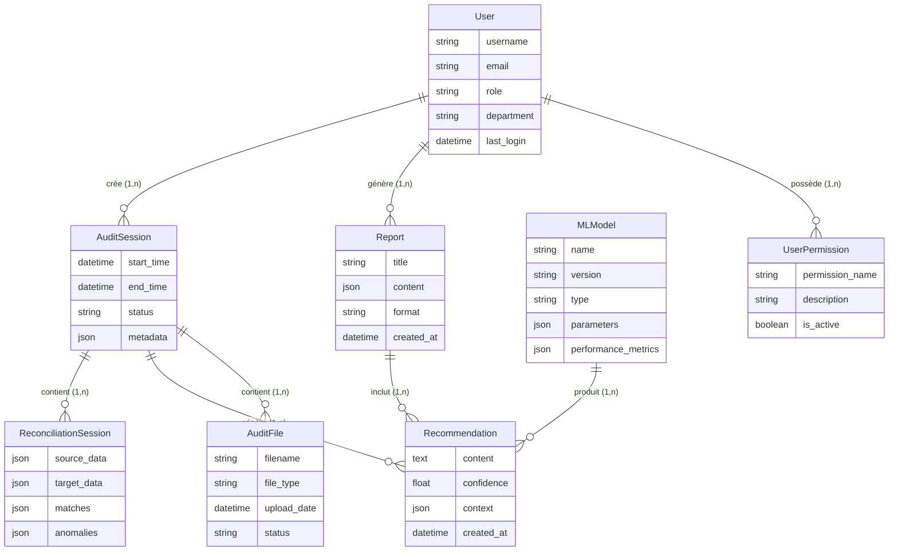
```mermaid
erDiagram
    User ||--o{ AuditSession : "crée (1,n)"
    User ||--o{ Report : "génère (1,n)"
    AuditSession ||--o{ ReconciliationSession : "contient (1,n)"
    AuditSession ||--o{ Recommendation : "génère (1,n)"
    MLModel ||--o{ Recommendation : "produit (1,n)"
    Report ||--o{ Recommendation : "inclut (1,n)"
    User ||--o{ UserPermission : "possède (1,n)"
    AuditSession ||--o{ AuditFile : "contient (1,n)"
    
    User {
        string username
        string email
        string role
        string department
        datetime last_login
    }
    
    UserPermission {
        string permission_name
        string description
        boolean is_active
    }
    
    AuditSession {
        datetime start_time
        datetime end_time
        string status
        json metadata
    }
    
    AuditFile {
        string filename
        string file_type
        datetime upload_date
        string status
    }
    
    ReconciliationSession {
        json source_data
        json target_data
        json matches
        json anomalies
    }
    
    Report {
        string title
        json content
        string format
        datetime created_at
    }
    
    Recommendation {
        text content
        float confidence
        json context
        datetime created_at
    }
    
    MLModel {
        string name
        string version
        string type
        json parameters
        json performance_metrics
    }
```

## 2. Diagramme de Cas d'Utilisation Général

```mermaid
graph TD
    subgraph "Acteurs"
        A1[Administrateur]
        A2[Auditeur]
    end
    
    subgraph "Fonctionnalités Administrateur"
        A1 --> B1[Gestion des Utilisateurs]
        A1 --> B2[Configuration Système]
        A1 --> B3[Gestion des Modèles ML]
        
        B1 --> B1_1[Créer Utilisateur]
        B1 --> B1_2[Modifier Rôles]
        B1 --> B1_3[Supprimer Utilisateur]
        
        B2 --> B2_1[Configurer Paramètres]
        B2 --> B2_2[Gérer Permissions]
        B2 --> B2_3[Configurer Notifications]
        
        B3 --> B3_1[Entraîner Modèles]
        B3 --> B3_2[Évaluer Performance]
        B3 --> B3_3[Mettre à Jour Modèles]
    end
    
    subgraph "Fonctionnalités Auditeur"
        A2 --> C1[Gestion des Audits]
        A2 --> C2[Génération de Rapports]
        A2 --> C3[Consultation des Recommandations]
        
        C1 --> C1_1[Créer un Audit]
        C1 --> C1_2[Analyser les Données]
        C1 --> C1_3[Réconcilier les Données]
        
        C2 --> C2_1[Générer PDF]
        C2 --> C2_2[Exporter Excel]
        C2 --> C2_3[Visualiser Graphiques]
        
        C3 --> C3_1[Voir Recommandations]
        C3 --> C3_2[Évaluer Recommandations]
        C3 --> C3_3[Appliquer Recommandations]
    end
```

## 3. Diagramme de Classes

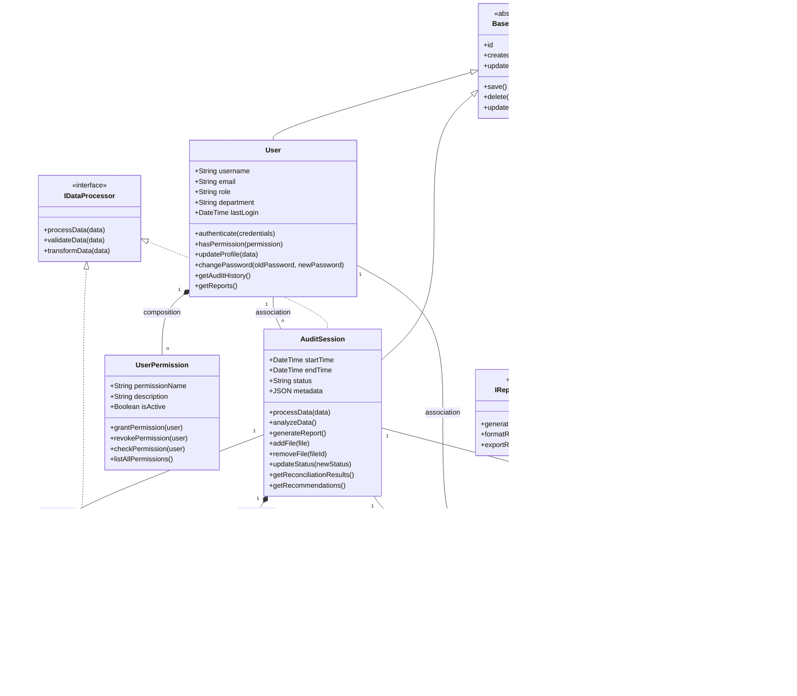
```mermaid
classDiagram
    %% Interfaces et Classes Abstraites
    class IDataProcessor {
        <<interface>>
        +processData(data)
        +validateData(data)
        +transformData(data)
    }
    
    class IReportGenerator {
        <<interface>>
        +generateReport()
        +formatReport()
        +exportReport()
    }
    
    class BaseModel {
        <<abstract>>
        +id
        +createdAt
        +updatedAt
        +save()
        +delete()
        +update()
    }
    
    %% Classes Concrètes
    class User {
        +String username
        +String email
        +String role
        +String department
        +DateTime lastLogin
        +authenticate(credentials)
        +hasPermission(permission)
        +updateProfile(data)
        +changePassword(oldPassword, newPassword)
        +getAuditHistory()
        +getReports()
    }
    
    class UserPermission {
        +String permissionName
        +String description
        +Boolean isActive
        +grantPermission(user)
        +revokePermission(user)
        +checkPermission(user)
        +listAllPermissions()
    }
    
    class AuditSession {
        +DateTime startTime
        +DateTime endTime
        +String status
        +JSON metadata
        +processData(data)
        +analyzeData()
        +generateReport()
        +addFile(file)
        +removeFile(fileId)
        +updateStatus(newStatus)
        +getReconciliationResults()
        +getRecommendations()
    }
    
    class AuditFile {
        +String filename
        +String fileType
        +DateTime uploadDate
        +String status
        +upload(file)
        +validate()
        +process()
        +delete()
        +getMetadata()
    }
    
    class ReconciliationSession {
        +JSON sourceData
        +JSON targetData
        +JSON matches
        +JSON anomalies
        +matchData()
        +detectAnomalies()
        +resolveConflicts()
        +generateReport()
        +exportResults()
        +getStatistics()
    }
    
    class Report {
        +String title
        +JSON content
        +String format
        +DateTime createdAt
        +generatePDF()
        +exportExcel()
        +createVisualization()
        +addSection(section)
        +removeSection(sectionId)
        +updateContent(content)
        +shareReport(users)
    }
    
    class Recommendation {
        +String content
        +Float confidence
        +JSON context
        +DateTime createdAt
        +evaluate()
        +apply()
        +updateConfidence(newValue)
        +getHistory()
        +markAsImplemented()
    }
    
    class MLModel {
        +String name
        +String version
        +String type
        +JSON parameters
        +JSON performanceMetrics
        +train(data)
        +predict(input)
        +evaluate(testData)
        +updateParameters(params)
        +saveModel()
        +loadModel()
        +getPerformanceMetrics()
    }
    
    %% Relations
    BaseModel <|-- User
    BaseModel <|-- AuditSession
    BaseModel <|-- Report
    BaseModel <|-- Recommendation
    
    IDataProcessor <|.. AuditSession
    IDataProcessor <|.. ReconciliationSession
    IReportGenerator <|.. Report
    
    User "1" *-- "n" UserPermission : composition
    User "1" -- "n" AuditSession : association
    User "1" -- "n" Report : association
    AuditSession "1" *-- "n" AuditFile : composition
    AuditSession "1" -- "n" ReconciliationSession : association
    AuditSession "1" -- "n" Report : association
    AuditSession "1" -- "n" Recommendation : association
    MLModel "1" -- "n" Recommendation : association
```

## 4. Diagrammes de Séquence Spécifiques

### 4.1 Processus d'Authentification

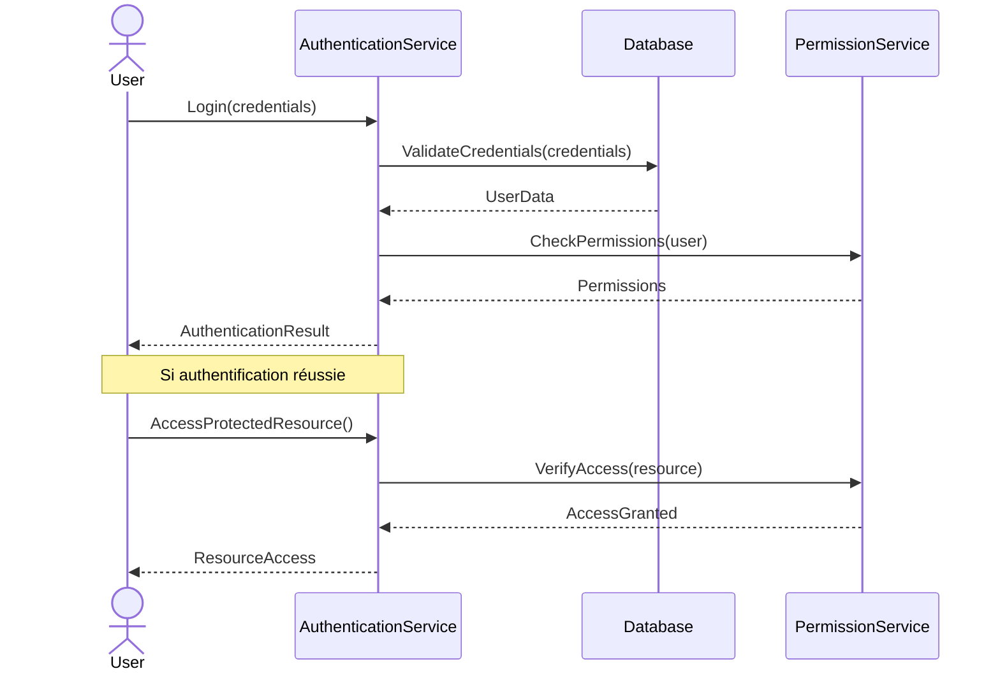
```mermaid
sequenceDiagram
    actor User
    participant Auth as AuthenticationService
    participant DB as Database
    participant Perm as PermissionService
    
    User->>Auth: Login(credentials)
    Auth->>DB: ValidateCredentials(credentials)
    DB-->>Auth: UserData
    Auth->>Perm: CheckPermissions(user)
    Perm-->>Auth: Permissions
    Auth-->>User: AuthenticationResult
    Note over User,Auth: Si authentification réussie
    User->>Auth: AccessProtectedResource()
    Auth->>Perm: VerifyAccess(resource)
    Perm-->>Auth: AccessGranted
    Auth-->>User: ResourceAccess
```

### 4.2 Processus de Réconciliation des Données

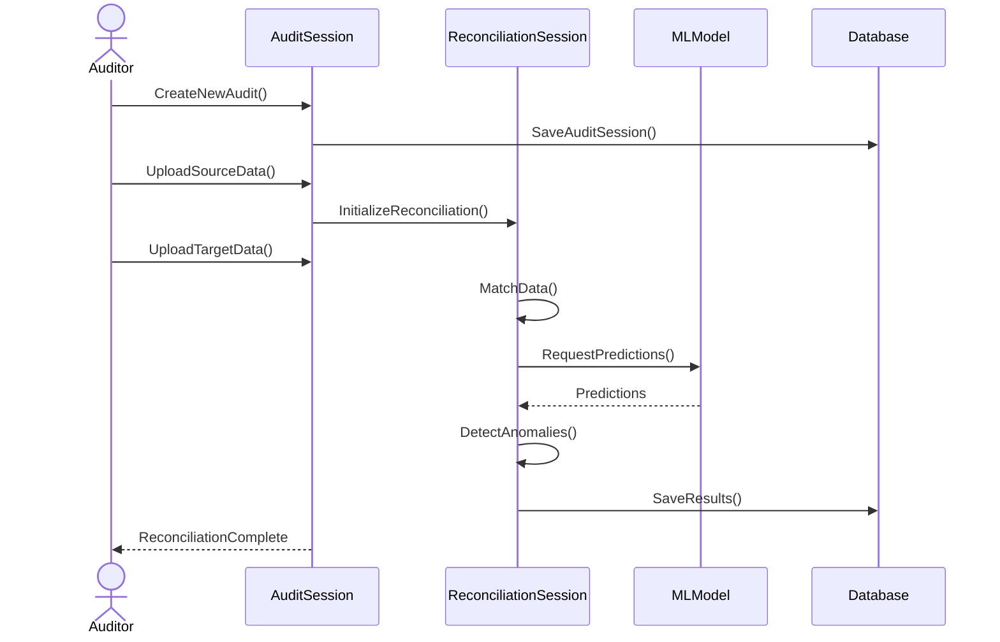
```mermaid
sequenceDiagram
    actor Auditor
    participant AS as AuditSession
    participant RS as ReconciliationSession
    participant ML as MLModel
    participant DB as Database
    
    Auditor->>AS: CreateNewAudit()
    AS->>DB: SaveAuditSession()
    Auditor->>AS: UploadSourceData()
    AS->>RS: InitializeReconciliation()
    Auditor->>AS: UploadTargetData()
    RS->>RS: MatchData()
    RS->>ML: RequestPredictions()
    ML-->>RS: Predictions
    RS->>RS: DetectAnomalies()
    RS->>DB: SaveResults()
    AS-->>Auditor: ReconciliationComplete
```

### 4.3 Génération de Rapport avec Recommandations

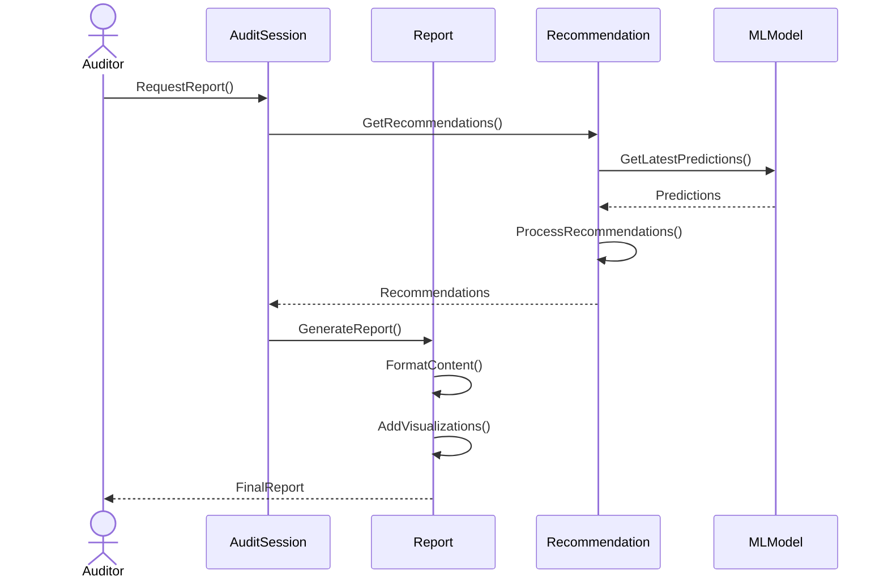
```mermaid
sequenceDiagram
    actor Auditor
    participant AS as AuditSession
    participant R as Report
    participant Rec as Recommendation
    participant ML as MLModel
    
    Auditor->>AS: RequestReport()
    AS->>Rec: GetRecommendations()
    Rec->>ML: GetLatestPredictions()
    ML-->>Rec: Predictions
    Rec->>Rec: ProcessRecommendations()
    Rec-->>AS: Recommendations
    AS->>R: GenerateReport()
    R->>R: FormatContent()
    R->>R: AddVisualizations()
    R-->>Auditor: FinalReport
```

### 4.4 Entraînement du Modèle ML

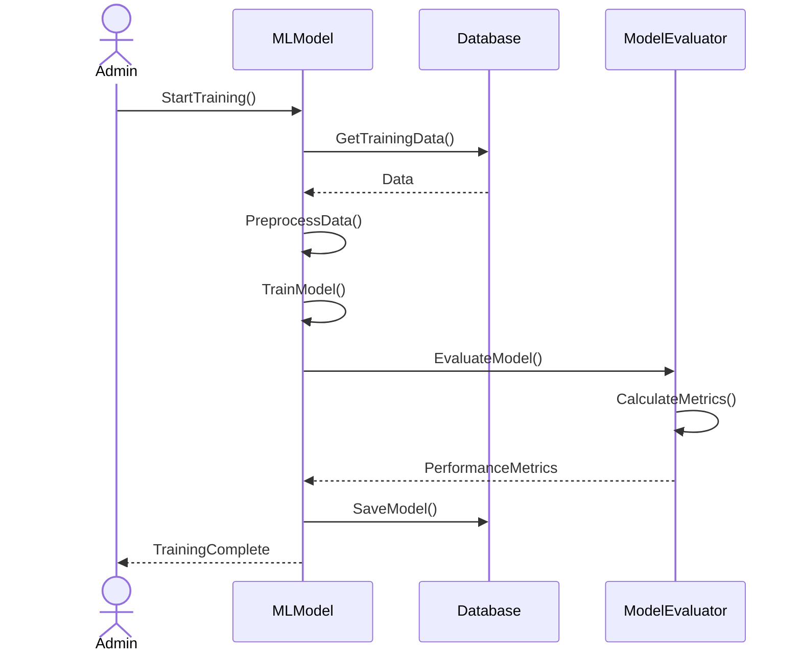
```mermaid
sequenceDiagram
    actor Admin
    participant ML as MLModel
    participant DB as Database
    participant Eval as ModelEvaluator
    
    Admin->>ML: StartTraining()
    ML->>DB: GetTrainingData()
    DB-->>ML: Data
    ML->>ML: PreprocessData()
    ML->>ML: TrainModel()
    ML->>Eval: EvaluateModel()
    Eval->>Eval: CalculateMetrics()
    Eval-->>ML: PerformanceMetrics
    ML->>DB: SaveModel()
    ML-->>Admin: TrainingComplete
```

## 5. Diagramme d'Activité (Processus d'Audit Complet)

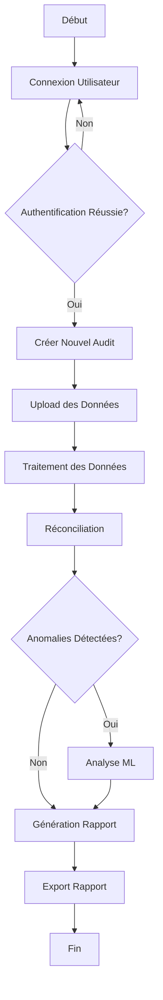
```mermaid
graph TD
    A[Début] --> B[Connexion Utilisateur]
    B --> C{Authentification Réussie?}
    C -->|Non| B
    C -->|Oui| D[Créer Nouvel Audit]
    D --> E[Upload des Données]
    E --> F[Traitement des Données]
    F --> G[Réconciliation]
    G --> H{Anomalies Détectées?}
    H -->|Oui| I[Analyse ML]
    H -->|Non| J[Génération Rapport]
    I --> J
    J --> K[Export Rapport]
    K --> L[Fin]
```

## Notes Explicatives des Diagrammes

### 1. Modèle Conceptuel de Données (MCD)

#### Objectif
Le MCD représente la structure conceptuelle des données de l'application, indépendamment de toute considération technique. Il permet de visualiser les entités principales et leurs relations.

#### Interprétation
- **Entités** : Représentées par des rectangles (User, AuditSession, etc.)
- **Relations** : Représentées par des lignes entre les entités
- **Cardinalités** : Indiquées par (1,n) où :
  - 1 : Une seule instance
  - n : Plusieurs instances possibles
- **Attributs** : Listés dans chaque entité avec leur type

#### Points Clés
- Chaque utilisateur peut créer plusieurs sessions d'audit
- Une session d'audit peut contenir plusieurs fichiers
- Les recommandations sont liées à la fois aux sessions d'audit et aux modèles ML
- Le système de permissions est intégré directement dans l'entité User

### 2. Diagramme de Cas d'Utilisation

#### Objectif
Ce diagramme illustre les interactions possibles entre les utilisateurs (acteurs) et le système, en distinguant les rôles d'administrateur et d'auditeur.

#### Interprétation
- **Acteurs** : Représentés par des icônes humaines (Administrateur, Auditeur)
- **Cas d'utilisation** : Représentés par des ovales
- **Relations** : Lignes entre acteurs et cas d'utilisation
- **Sous-systèmes** : Regroupements logiques des fonctionnalités

#### Points Clés
- Séparation claire des responsabilités entre administrateur et auditeur
- Hiérarchie des fonctionnalités (principales et secondaires)
- Flux de travail typique pour chaque rôle
- Points d'interaction entre les différents cas d'utilisation

### 3. Diagramme de Classes

#### Objectif
Ce diagramme représente la structure statique du système, montrant les classes, leurs attributs, méthodes et les relations entre elles.

#### Interprétation
- **Classes** : Représentées par des rectangles divisés en trois sections :
  - Nom de la classe
  - Attributs
  - Méthodes
- **Relations** :
  - Héritage : Flèche pleine avec triangle (BaseModel <|-- User)
  - Implémentation d'interface : Flèche pointillée (IDataProcessor <|.. AuditSession)
  - Composition : Losange plein (User *-- UserPermission)
  - Association : Ligne simple (User -- AuditSession)

#### Concepts OOP Utilisés
1. **Héritage** :
   - BaseModel comme classe abstraite parente
   - Réutilisation du code commun (id, createdAt, etc.)

2. **Abstraction** :
   - Interfaces IDataProcessor et IReportGenerator
   - Définition de contrats pour les classes qui les implémentent

3. **Polymorphisme** :
   - Différentes implémentations de IDataProcessor
   - Traitement uniforme des différents types de rapports

4. **Composition** :
   - User contient UserPermission
   - AuditSession contient AuditFile

5. **Agrégation** :
   - Relations plus lâches entre les autres classes
   - Possibilité de réutilisation des composants

### 4. Diagrammes de Séquence

#### Objectif
Ces diagrammes illustrent les interactions entre les objets dans le temps, montrant comment les messages sont échangés entre les différents composants.

#### Interprétation
- **Acteurs** : Représentés par des icônes humaines
- **Objets** : Représentés par des rectangles
- **Messages** : Flèches entre les objets
- **Temps** : S'écoule du haut vers le bas

#### Détail des Diagrammes de Séquence

1. **Processus d'Authentification**
   - Flux complet de l'authentification
   - Vérification des permissions
   - Gestion des accès aux ressources

2. **Processus de Réconciliation**
   - Workflow de réconciliation des données
   - Intégration avec le ML
   - Gestion des anomalies

3. **Génération de Rapport**
   - Processus de création de rapport
   - Intégration des recommandations
   - Ajout de visualisations

4. **Entraînement du Modèle ML**
   - Cycle complet d'entraînement
   - Évaluation des performances
   - Persistance du modèle

#### Points Clés pour l'Interprétation
- Les flèches pleines représentent des messages synchrones
- Les flèches pointillées représentent des retours
- Les notes (Note over) fournissent des informations contextuelles
- L'ordre vertical représente la chronologie des événements

### Conseils d'Utilisation

1. **Pour le Développement**
   - Utiliser le diagramme de classes comme référence pour l'implémentation
   - Suivre les diagrammes de séquence pour les flux de travail
   - Respecter les relations définies dans le MCD

2. **Pour la Maintenance**
   - Le MCD aide à comprendre la structure des données
   - Les diagrammes de séquence facilitent le débogage
   - Le diagramme de classes guide les modifications

3. **Pour l'Évolution**
   - Les interfaces permettent d'ajouter facilement de nouvelles fonctionnalités
   - La séparation des rôles facilite l'ajout de nouveaux acteurs
   - La modularité permet l'extension du système 

# Diagrammes et Architecture Visuelle - Audit IA

## Table des Matières

1. [Architecture Globale](#architecture-globale)
2. [Flux de Données](#flux-de-données)
3. [Workflows Utilisateur](#workflows-utilisateur)
4. [Sécurité](#sécurité)
5. [Base de Données](#base-de-données)
6. [Déploiement](#déploiement)
7. [Intégration IA](#intégration-ia)

---

## Architecture Globale

### Vue d'Ensemble du Système

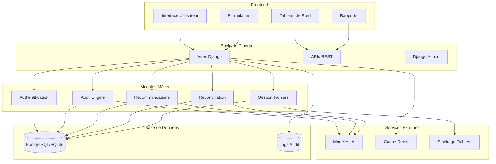
```mermaid
graph TB
    subgraph "Frontend"
        UI[Interface Utilisateur]
        Dashboard[Tableau de Bord]
        Forms[Formulaires]
        Reports[Rapports]
    end
    
    subgraph "Backend Django"
        Views[Vues Django]
        APIs[APIs REST]
        Admin[Django Admin]
    end
    
    subgraph "Modules Métier"
        Auth[Authentification]
        Audit[Audit Engine]
        Rec[Recommandations]
        Recon[Réconciliation]
        Upload[Gestion Fichiers]
    end
    
    subgraph "Services Externes"
        ML[Modèles IA]
        Cache[Cache Redis]
        Storage[Stockage Fichiers]
    end
    
    subgraph "Base de Données"
        DB[(PostgreSQL/SQLite)]
        Logs[(Logs Audit)]
    end
    
    UI --> Views
    Dashboard --> APIs
    Forms --> Views
    Reports --> APIs
    
    Views --> Auth
    Views --> Audit
    Views --> Rec
    Views --> Recon
    Views --> Upload
    
    Audit --> ML
    Rec --> ML
    Recon --> ML
    
    Auth --> DB
    Audit --> DB
    Rec --> DB
    Recon --> DB
    Upload --> DB
    
    Upload --> Storage
    Views --> Cache
    Views --> Logs
```

### Architecture des Modules

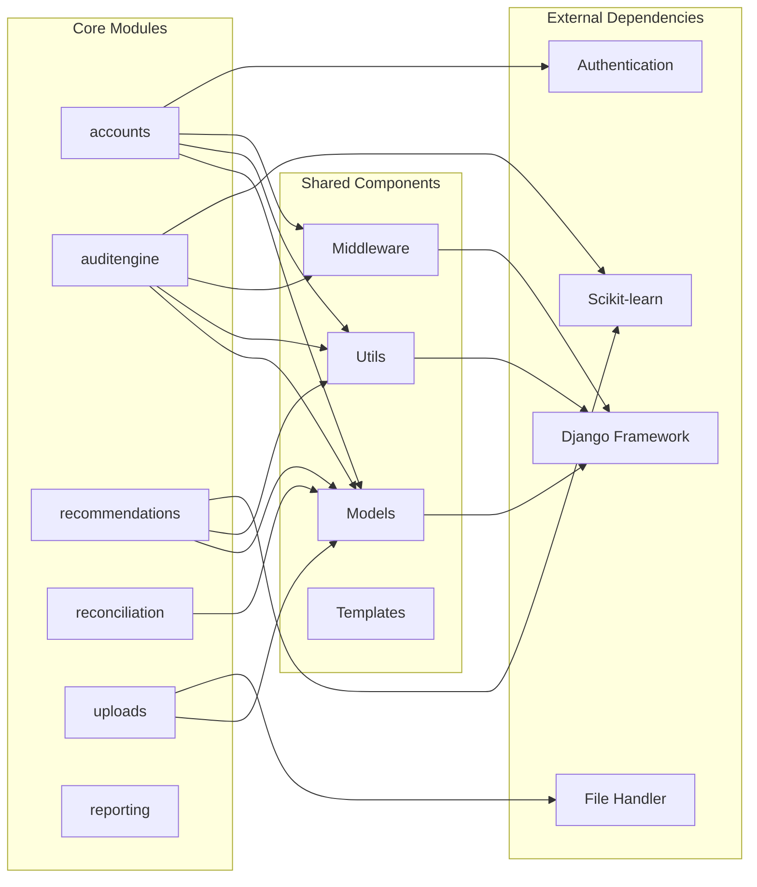
```mermaid
graph LR
    subgraph "Core Modules"
        Accounts[accounts]
        AuditEngine[auditengine]
        Recommendations[recommendations]
        Reconciliation[reconciliation]
        Uploads[uploads]
        Reporting[reporting]
    end
    
    subgraph "Shared Components"
        Models[Models]
        Utils[Utils]
        Middleware[Middleware]
        Templates[Templates]
    end
    
    subgraph "External Dependencies"
        Django[Django Framework]
        ML[Scikit-learn]
        Auth[Authentication]
        FileHandler[File Handler]
    end
    
    Accounts --> Models
    AuditEngine --> Models
    Recommendations --> Models
    Reconciliation --> Models
    Uploads --> Models
    
    Accounts --> Utils
    AuditEngine --> Utils
    Recommendations --> Utils
    
    Accounts --> Middleware
    AuditEngine --> Middleware
    
    Models --> Django
    Utils --> Django
    Middleware --> Django
    
    AuditEngine --> ML
    Recommendations --> ML
    
    Accounts --> Auth
    Uploads --> FileHandler
```

---

## Flux de Données

### Workflow d'Upload et Analyse

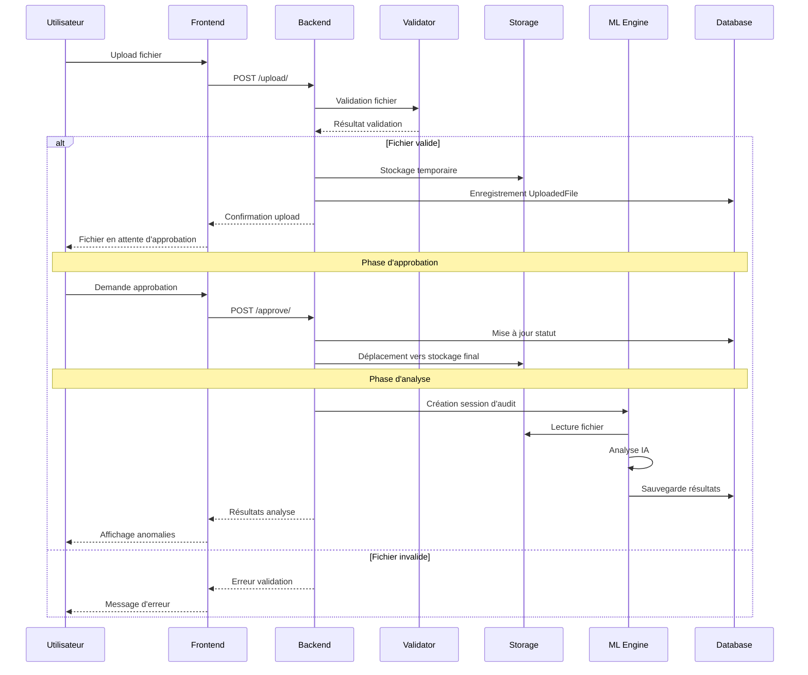
```mermaid
sequenceDiagram
    participant U as Utilisateur
    participant F as Frontend
    participant B as Backend
    participant V as Validator
    participant S as Storage
    participant ML as ML Engine
    participant DB as Database
    
    U->>F: Upload fichier
    F->>B: POST /upload/
    B->>V: Validation fichier
    V-->>B: Résultat validation
    
    alt Fichier valide
        B->>S: Stockage temporaire
        B->>DB: Enregistrement UploadedFile
        B-->>F: Confirmation upload
        F-->>U: Fichier en attente d'approbation
        
        Note over U,DB: Phase d'approbation
        U->>F: Demande approbation
        F->>B: POST /approve/
        B->>DB: Mise à jour statut
        B->>S: Déplacement vers stockage final
        
        Note over U,DB: Phase d'analyse
        B->>ML: Création session d'audit
        ML->>S: Lecture fichier
        ML->>ML: Analyse IA
        ML->>DB: Sauvegarde résultats
        B-->>F: Résultats analyse
        F-->>U: Affichage anomalies
    else Fichier invalide
        B-->>F: Erreur validation
        F-->>U: Message d'erreur
    end
```

### Flux de Recommandations

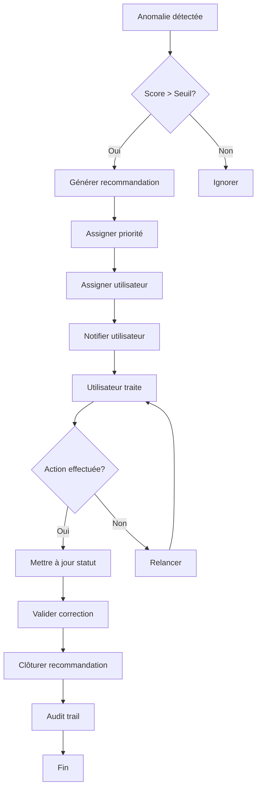
```mermaid
flowchart TD
    A[Anomalie détectée] --> B{Score > Seuil?}
    B -->|Oui| C[Générer recommandation]
    B -->|Non| D[Ignorer]
    
    C --> E[Assigner priorité]
    E --> F[Assigner utilisateur]
    F --> G[Notifier utilisateur]
    
    G --> H[Utilisateur traite]
    H --> I{Action effectuée?}
    I -->|Oui| J[Mettre à jour statut]
    I -->|Non| K[Relancer]
    
    J --> L[Valider correction]
    L --> M[Clôturer recommandation]
    K --> H
    
    M --> N[Audit trail]
    N --> O[Fin]
```

### Flux de Réconciliation

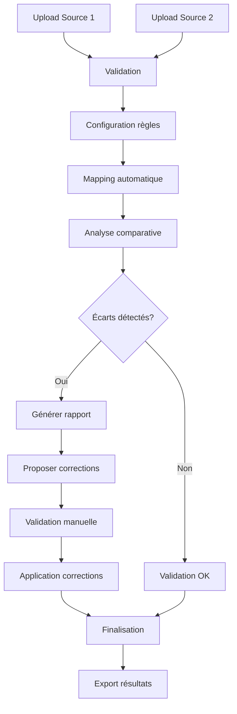
```mermaid
graph TD
    A[Upload Source 1] --> B[Validation]
    C[Upload Source 2] --> B
    B --> D[Configuration règles]
    D --> E[Mapping automatique]
    E --> F[Analyse comparative]
    F --> G{Écarts détectés?}
    
    G -->|Oui| H[Générer rapport]
    G -->|Non| I[Validation OK]
    
    H --> J[Proposer corrections]
    J --> K[Validation manuelle]
    K --> L[Application corrections]
    L --> M[Finalisation]
    
    I --> M
    M --> N[Export résultats]
```

---

## Workflows Utilisateur

### Workflow Administrateur

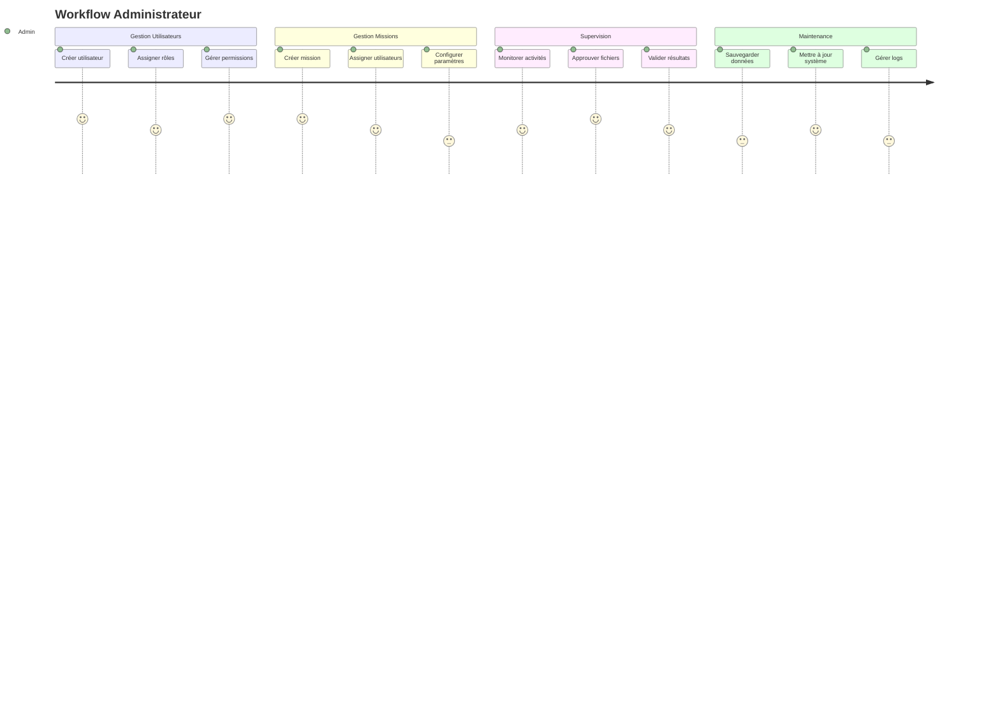
```mermaid
journey
    title Workflow Administrateur
    section Gestion Utilisateurs
      Créer utilisateur: 5: Admin
      Assigner rôles: 4: Admin
      Gérer permissions: 5: Admin
    section Gestion Missions
      Créer mission: 5: Admin
      Assigner utilisateurs: 4: Admin
      Configurer paramètres: 3: Admin
    section Supervision
      Monitorer activités: 4: Admin
      Approuver fichiers: 5: Admin
      Valider résultats: 4: Admin
    section Maintenance
      Sauvegarder données: 3: Admin
      Mettre à jour système: 4: Admin
      Gérer logs: 3: Admin
```

### Workflow Utilisateur Standard

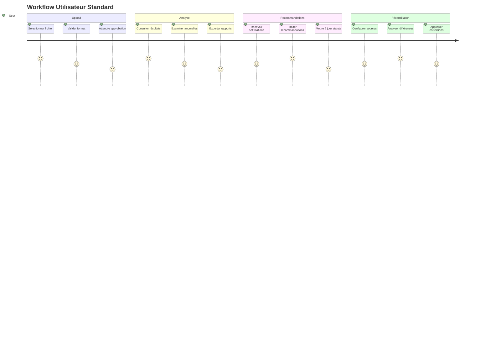
```mermaid
journey
    title Workflow Utilisateur Standard
    section Upload
      Sélectionner fichier: 5: User
      Valider format: 4: User
      Attendre approbation: 3: User
    section Analyse
      Consulter résultats: 5: User
      Examiner anomalies: 4: User
      Exporter rapports: 3: User
    section Recommandations
      Recevoir notifications: 4: User
      Traiter recommandations: 5: User
      Mettre à jour statuts: 3: User
    section Réconciliation
      Configurer sources: 4: User
      Analyser différences: 5: User
      Appliquer corrections: 4: User
```

### Workflow Auditeur

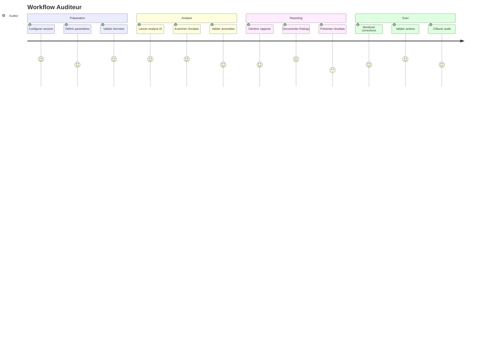
```mermaid
journey
    title Workflow Auditeur
    section Préparation
      Configurer session: 5: Auditor
      Définir paramètres: 4: Auditor
      Valider données: 5: Auditor
    section Analyse
      Lancer analyse IA: 5: Auditor
      Examiner résultats: 5: Auditor
      Valider anomalies: 4: Auditor
    section Reporting
      Générer rapports: 4: Auditor
      Documenter findings: 5: Auditor
      Présenter résultats: 3: Auditor
    section Suivi
      Monitorer corrections: 4: Auditor
      Valider actions: 5: Auditor
      Clôturer audit: 4: Auditor
```

---

## Sécurité

### Architecture de Sécurité

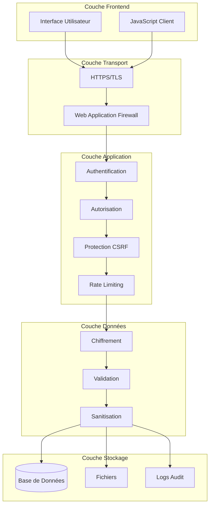
```mermaid
graph TB
    subgraph "Couche Frontend"
        UI[Interface Utilisateur]
        JS[JavaScript Client]
    end
    
    subgraph "Couche Transport"
        HTTPS[HTTPS/TLS]
        WAF[Web Application Firewall]
    end
    
    subgraph "Couche Application"
        Auth[Authentification]
        Authz[Autorisation]
        CSRF[Protection CSRF]
        RateLimit[Rate Limiting]
    end
    
    subgraph "Couche Données"
        Encryption[Chiffrement]
        Validation[Validation]
        Sanitization[Sanitisation]
    end
    
    subgraph "Couche Stockage"
        DB[(Base de Données)]
        Files[Fichiers]
        Logs[Logs Audit]
    end
    
    UI --> HTTPS
    JS --> HTTPS
    HTTPS --> WAF
    WAF --> Auth
    Auth --> Authz
    Authz --> CSRF
    CSRF --> RateLimit
    RateLimit --> Encryption
    Encryption --> Validation
    Validation --> Sanitization
    Sanitization --> DB
    Sanitization --> Files
    Sanitization --> Logs
```

### Flux d'Authentification

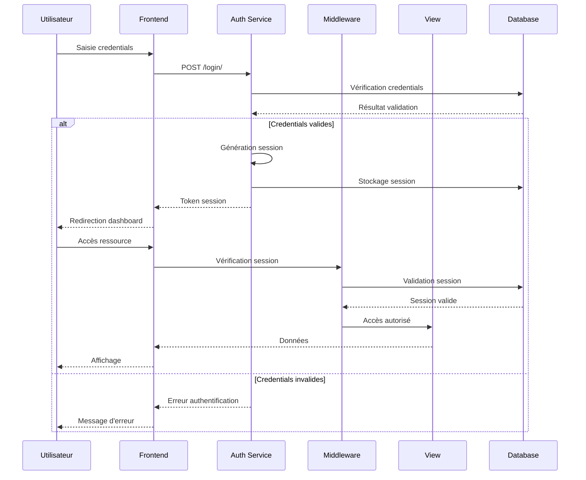
```mermaid
sequenceDiagram
    participant U as Utilisateur
    participant F as Frontend
    participant A as Auth Service
    participant M as Middleware
    participant V as View
    participant DB as Database
    
    U->>F: Saisie credentials
    F->>A: POST /login/
    A->>DB: Vérification credentials
    DB-->>A: Résultat validation
    
    alt Credentials valides
        A->>A: Génération session
        A->>DB: Stockage session
        A-->>F: Token session
        F-->>U: Redirection dashboard
        
        U->>F: Accès ressource
        F->>M: Vérification session
        M->>DB: Validation session
        DB-->>M: Session valide
        M->>V: Accès autorisé
        V-->>F: Données
        F-->>U: Affichage
    else Credentials invalides
        A-->>F: Erreur authentification
        F-->>U: Message d'erreur
    end
```

### Isolation des Données

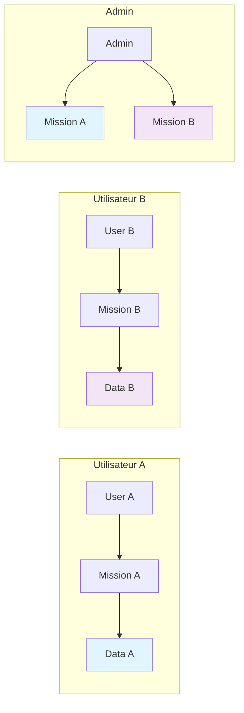
```mermaid
graph LR
    subgraph "Utilisateur A"
        UA[User A]
        MA[Mission A]
        DA[Data A]
    end
    
    subgraph "Utilisateur B"
        UB[User B]
        MB[Mission B]
        DB[Data B]
    end
    
    subgraph "Admin"
        AD[Admin]
        MA2[Mission A]
        MB2[Mission B]
    end
    
    UA --> MA
    MA --> DA
    UB --> MB
    MB --> DB
    
    AD --> MA2
    AD --> MB2
    
    style DA fill:#e1f5fe
    style DB fill:#f3e5f5
    style MA2 fill:#e1f5fe
    style MB2 fill:#f3e5f5
```

---

## Base de Données

### Schéma Entité-Relation

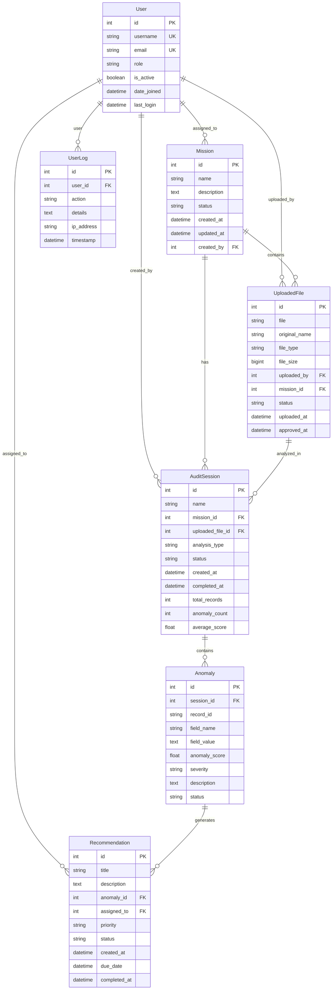
```mermaid
erDiagram
    User {
        int id PK
        string username UK
        string email UK
        string role
        boolean is_active
        datetime date_joined
        datetime last_login
    }
    
    Mission {
        int id PK
        string name
        text description
        string status
        datetime created_at
        datetime updated_at
        int created_by FK
    }
    
    AuditSession {
        int id PK
        string name
        int mission_id FK
        int uploaded_file_id FK
        string analysis_type
        string status
        datetime created_at
        datetime completed_at
        int total_records
        int anomaly_count
        float average_score
    }
    
    Anomaly {
        int id PK
        int session_id FK
        string record_id
        string field_name
        text field_value
        float anomaly_score
        string severity
        text description
        string status
    }
    
    Recommendation {
        int id PK
        string title
        text description
        int anomaly_id FK
        int assigned_to FK
        string priority
        string status
        datetime created_at
        datetime due_date
        datetime completed_at
    }
    
    UploadedFile {
        int id PK
        string file
        string original_name
        string file_type
        bigint file_size
        int uploaded_by FK
        int mission_id FK
        string status
        datetime uploaded_at
        datetime approved_at
    }
    
    UserLog {
        int id PK
        int user_id FK
        string action
        text details
        string ip_address
        datetime timestamp
    }
    
    User ||--o{ Mission : "assigned_to"
    User ||--o{ AuditSession : "created_by"
    User ||--o{ Recommendation : "assigned_to"
    User ||--o{ UploadedFile : "uploaded_by"
    User ||--o{ UserLog : "user"
    
    Mission ||--o{ AuditSession : "has"
    Mission ||--o{ UploadedFile : "contains"
    
    AuditSession ||--o{ Anomaly : "contains"
    Anomaly ||--o{ Recommendation : "generates"
    
    UploadedFile ||--o{ AuditSession : "analyzed_in"
```

### Relations et Contraintes

```mermaid
graph TD
    subgraph "Entités Principales"
        U[User]
        M[Mission]
        AS[AuditSession]
        A[Anomaly]
        R[Recommendation]
        UF[UploadedFile]
    end
    
    subgraph "Relations"
        U -->|1:N| M
        U -->|1:N| AS
        U -->|1:N| R
        U -->|1:N| UF
        
        M -->|1:N| AS
        M -->|1:N| UF
        
        AS -->|1:N| A
        A -->|1:N| R
        UF -->|1:1| AS
    end
    
    subgraph "Contraintes"
        C1[User.role IN admin,user,auditor]
        C2[Mission.status IN active,completed,archived]
        C3[AS.status IN pending,running,completed,failed]
        C4[A.anomaly_score BETWEEN 0 AND 100]
        C5[R.priority IN low,medium,high,critical]
        C6[R.status IN pending,in_progress,completed]
    end
```

---

## Déploiement

### Architecture de Déploiement

```mermaid
graph TB
    subgraph "Load Balancer"
        LB[NGINX Load Balancer]
    end
    
    subgraph "Application Servers"
        AS1[App Server 1]
        AS2[App Server 2]
        AS3[App Server 3]
    end
    
    subgraph "Services"
        DB[(PostgreSQL)]
        Cache[(Redis)]
        Storage[File Storage]
        ML[ML Models]
    end
    
    subgraph "Monitoring"
        Logs[Log Aggregation]
        Metrics[Metrics Collection]
        Alerts[Alert System]
    end
    
    LB --> AS1
    LB --> AS2
    LB --> AS3
    
    AS1 --> DB
    AS2 --> DB
    AS3 --> DB
    
    AS1 --> Cache
    AS2 --> Cache
    AS3 --> Cache
    
    AS1 --> Storage
    AS2 --> Storage
    AS3 --> Storage
    
    AS1 --> ML
    AS2 --> ML
    AS3 --> ML
    
    AS1 --> Logs
    AS2 --> Logs
    AS3 --> Logs
    
    Logs --> Metrics
    Metrics --> Alerts
```

### Pipeline CI/CD

```mermaid
graph LR
    subgraph "Development"
        Code[Code Changes]
        Tests[Unit Tests]
        Lint[Code Linting]
    end
    
    subgraph "Staging"
        Build[Build Application]
        DeployStaging[Deploy to Staging]
        IntegrationTests[Integration Tests]
    end
    
    subgraph "Production"
        DeployProd[Deploy to Production]
        SmokeTests[Smoke Tests]
        Monitoring[Monitoring]
    end
    
    Code --> Tests
    Tests --> Lint
    Lint --> Build
    Build --> DeployStaging
    DeployStaging --> IntegrationTests
    IntegrationTests --> DeployProd
    DeployProd --> SmokeTests
    SmokeTests --> Monitoring
```

### Configuration Environnements

```mermaid
graph TD
    subgraph "Development"
        DevDB[(SQLite)]
        DevCache[Local Cache]
        DevSettings[settings_dev.py]
    end
    
    subgraph "Staging"
        StagingDB[(PostgreSQL Staging)]
        StagingCache[Redis Staging]
        StagingSettings[settings_staging.py]
    end
    
    subgraph "Production"
        ProdDB[(PostgreSQL Production)]
        ProdCache[Redis Production]
        ProdSettings[settings_prod.py]
    end
    
    DevSettings --> DevDB
    DevSettings --> DevCache
    
    StagingSettings --> StagingDB
    StagingSettings --> StagingCache
    
    ProdSettings --> ProdDB
    ProdSettings --> ProdCache
```

---

## Intégration IA

### Pipeline Machine Learning

```mermaid
graph TD
    subgraph "Data Input"
        RawData[Données Brutes]
        Preprocessing[Prétraitement]
        FeatureExtraction[Extraction Features]
    end
    
    subgraph "Model Training"
        TrainData[Données d'Entraînement]
        ModelTraining[Entraînement Modèle]
        ModelValidation[Validation Modèle]
        ModelSelection[Sélection Modèle]
    end
    
    subgraph "Model Deployment"
        ModelSave[Sauvegarde Modèle]
        ModelLoad[Chargement Modèle]
        Prediction[Prédictions]
    end
    
    subgraph "Feedback Loop"
        Results[Résultats]
        PerformanceEval[Évaluation Performance]
        ModelUpdate[Mise à Jour Modèle]
    end
    
    RawData --> Preprocessing
    Preprocessing --> FeatureExtraction
    FeatureExtraction --> TrainData
    TrainData --> ModelTraining
    ModelTraining --> ModelValidation
    ModelValidation --> ModelSelection
    ModelSelection --> ModelSave
    ModelSave --> ModelLoad
    ModelLoad --> Prediction
    Prediction --> Results
    Results --> PerformanceEval
    PerformanceEval --> ModelUpdate
    ModelUpdate --> ModelTraining
```

### Architecture des Modèles IA

```mermaid
graph TB
    subgraph "Modèles de Détection"
        IF[Isolation Forest]
        MLP[MLP Classifier]
        SVM[SVM]
        RF[Random Forest]
    end
    
    subgraph "Prétraitement"
        Scaling[Standard Scaling]
        Encoding[Label Encoding]
        Imputation[Imputation]
        OutlierRemoval[Suppression Outliers]
    end
    
    subgraph "Post-traitement"
        ScoreCalculation[Calcul Scores]
        Thresholding[Seuillage]
        Ranking[Classement]
        Filtering[Filtrage]
    end
    
    subgraph "Intégration"
        ModelEnsemble[Ensemble]
        Voting[Voting System]
        Weighting[Pondération]
        FinalScore[Score Final]
    end
    
    Scaling --> IF
    Scaling --> MLP
    Scaling --> SVM
    Scaling --> RF
    
    Encoding --> IF
    Encoding --> MLP
    Encoding --> SVM
    Encoding --> RF
    
    IF --> ScoreCalculation
    MLP --> ScoreCalculation
    SVM --> ScoreCalculation
    RF --> ScoreCalculation
    
    ScoreCalculation --> Thresholding
    Thresholding --> Ranking
    Ranking --> Filtering
    Filtering --> ModelEnsemble
    
    ModelEnsemble --> Voting
    Voting --> Weighting
    Weighting --> FinalScore
```

### Flux de Détection d'Anomalies

```mermaid
sequenceDiagram
    participant DS as Data Source
    participant PP as Preprocessor
    participant IF as Isolation Forest
    participant MLP as MLP Classifier
    participant ES as Ensemble System
    participant DB as Database
    
    DS->>PP: Données brutes
    PP->>PP: Nettoyage et normalisation
    PP->>IF: Données prétraitées
    PP->>MLP: Données prétraitées
    
    IF->>IF: Calcul score IF
    MLP->>MLP: Calcul score MLP
    
    IF->>ES: Score IF
    MLP->>ES: Score MLP
    
    ES->>ES: Combinaison scores
    ES->>ES: Calcul score final
    
    ES->>DB: Sauvegarde résultats
    ES->>DB: Enregistrement anomalies
    
    Note over DS,DB: Le score final est normalisé entre 0 et 100%
```

---

## Métriques et KPIs

### Tableau de Bord Métriques

```mermaid
graph TB
    subgraph "Performance"
        ResponseTime[Temps de Réponse]
        Throughput[Débit]
        ErrorRate[Taux d'Erreur]
        Uptime[Disponibilité]
    end
    
    subgraph "Qualité IA"
        Accuracy[Précision]
        Recall[Rappel]
        F1Score[Score F1]
        FalsePositives[Faux Positifs]
    end
    
    subgraph "Utilisation"
        ActiveUsers[Utilisateurs Actifs]
        SessionsCount[Nombre Sessions]
        FilesProcessed[Fichiers Traités]
        RecommendationsGenerated[Recommandations Générées]
    end
    
    subgraph "Sécurité"
        FailedLogins[Tentatives Échouées]
        SuspiciousActivities[Activités Suspectes]
        DataAccessLogs[Logs d'Accès]
        SecurityIncidents[Incidents Sécurité]
    end
```

### Évolution des Performances

```mermaid
gantt
    title Évolution des Performances
    dateFormat  YYYY-MM-DD
    section Optimisation Base de Données
        Indexation    :done, db1, 2024-01-01, 2024-01-15
        Requêtes      :done, db2, 2024-01-16, 2024-01-30
        Cache         :active, db3, 2024-02-01, 2024-02-15
    section Optimisation IA
        Modèles       :done, ml1, 2024-01-01, 2024-01-20
        Prétraitement :done, ml2, 2024-01-21, 2024-02-10
        Ensemble      :ml3, 2024-02-11, 2024-03-01
    section Interface Utilisateur
        Responsive    :done, ui1, 2024-01-01, 2024-01-25
        Performance   :active, ui2, 2024-01-26, 2024-02-20
        UX/UI         :ui3, 2024-02-21, 2024-03-15
```

---

## Conclusion

Ces diagrammes fournissent une vue complète et visuelle de l'architecture, des flux de données, des workflows utilisateur et des aspects techniques de l'application Audit IA. Ils facilitent la compréhension du système pour les développeurs, administrateurs et utilisateurs finaux.

### Points Clés des Diagrammes

1. **Architecture modulaire** : Séparation claire des responsabilités
2. **Sécurité intégrée** : Protection à tous les niveaux
3. **Scalabilité** : Architecture adaptée à la croissance
4. **Maintenabilité** : Structure claire et documentée
5. **Performance** : Optimisations identifiées et mesurées

### Utilisation des Diagrammes

- **Développement** : Compréhension de l'architecture
- **Maintenance** : Identification des composants
- **Formation** : Apprentissage du système
- **Audit** : Vérification de la conformité
- **Évolution** : Planification des améliorations

---

*Diagrammes générés le : 2024-01-15*
*Version : 1.0*
*Dernière mise à jour : 2024-01-15* 